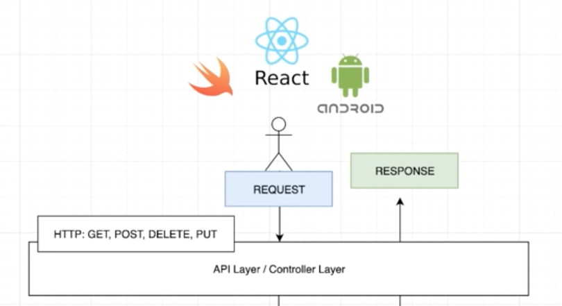
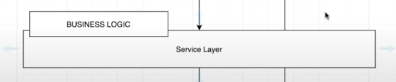
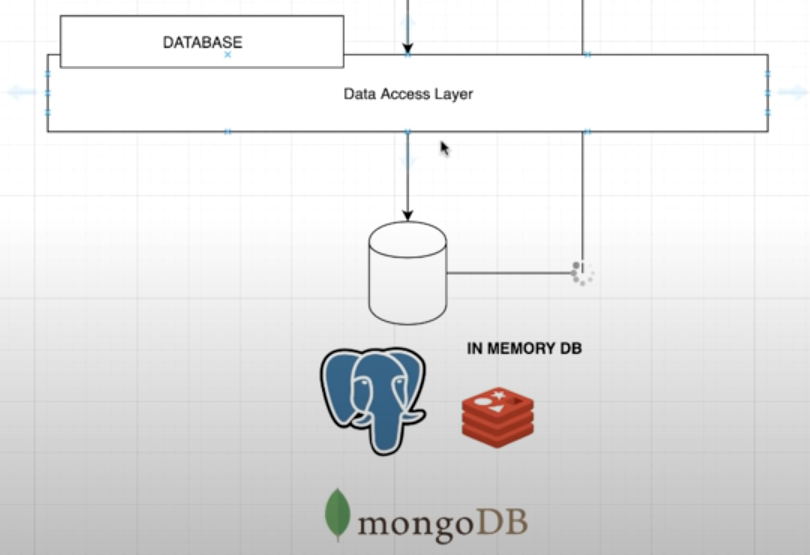
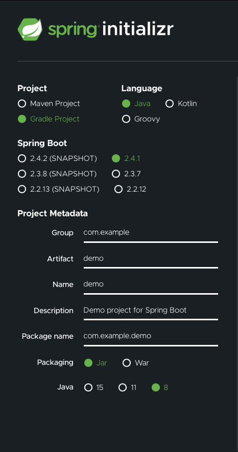
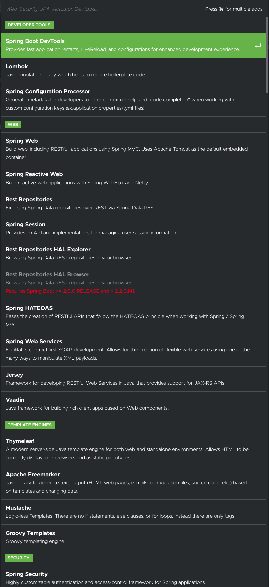
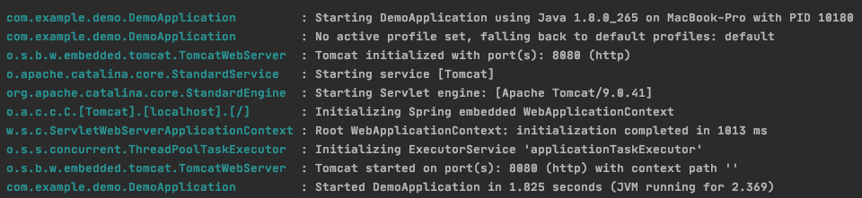

# Spring Learning
Notes and example codes when learning Spring Boot 

# Part 1 (Overview and building Spring Boot as Backend)
## Spring Boot
It is a framework for building java application very fast.  They provide things such as connectivity to databases and we do not need to configure low level code to get it up and running. It provide a platform for building backend application.

### Overview

Client can submit a request. We then take that request, and within that API layer or controller layer, we then send it to the service layer. 

The server layer is responsible to handle all the business logic that we have within the application. After business logic is performed, we can use a database for storing or so query operation. 

This layer is responsible to connect to any database of your choice. Good thing about spring boot and dependency injection is that we can start off the implementation. And if we want to switch to a different database, we simply only have to change one line of code. 

After you submit a request from any client (iOS, React or android), request will go through all the above layer and go back with a response to a client. The request can be a JSON payload, image, or a status code 200/400. 

### Spring Initializr 
start.spring.io allows you to bootstrap application by picking dependency and configuring the actual project. 

There is also a bunch of dependency. Spring Boot gives a lot of flexibility with these dependency. We can install them here and start coding right away. 

There is a bunch of section, making it very easy for you to configure and saving you the hassle. 

Running the code in src/main/java shows that tomcat is started on port 8080. And under resource, we have static and templates. Static is where all the web resource are at for web application, and templates where all the template for web application. Next is the application.properties, where we can define different properties for different environment. 

# Part 1 (Use Postgres as the main Database)

## Start a Postgres Database
`docker run --name postgres-spring -e POSTGRES_PASSWORD=password -d -p 5432:5432 postgres:alpine`
Since the focus of this repo is Spring Boot, stuff regarding Postgres is omitted. But for the application to work correctly, we need to following steps. 
- go into interactive mode
- create database called demodb
- create table call person
- insert few person for testing.

With that, the backend server implemented in Spring uses postgres as database, and this can be easily switch.

